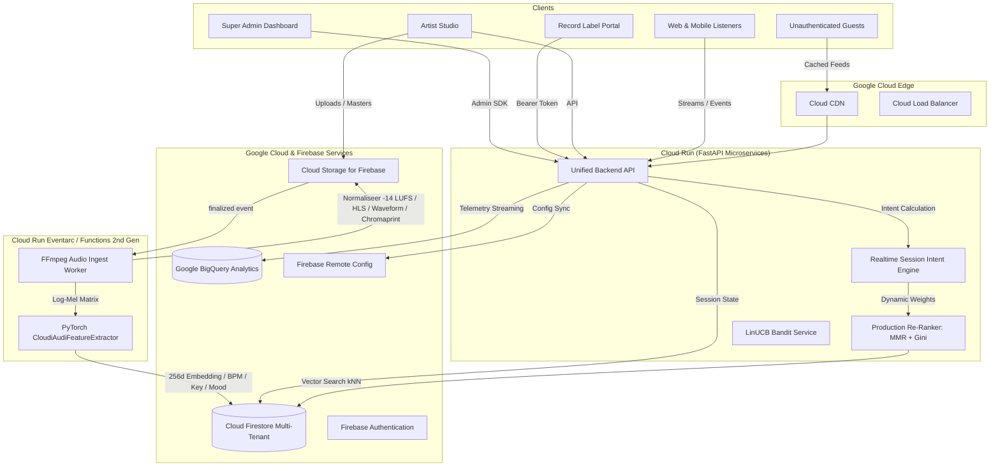

# CloudiAudi Production Backend Architecture

De end-to-end multi-tenant productie-architectuur van **CloudiAudi** verenigt:
- **Streaming-retentie** (Spotify-achtig): 30s survival-curves, -14 LUFS loudness normalisatie, HLS multi-bitrate streaming, adaptieve wachtrijen.
- **Sociale interactie** (SoundCloud-achtig): 1000-point interactieve waveform scrubbing, realtime timestamped comments met sentimentanalyse, openbare reposts en likes.
- **B2B-Beatmarktplaats** (BeatStars-achtig): Licentietiers (`basic_mp3`, `wav_lease`, `trackout`, `exclusive`), automatische royalty split-sheets en Stripe Connect koppelingen.

---

## 1. Multi-Tenant Rolsegregatie & RBAC

| Rol | Auth Token Claim (`role`) | Tenant Scoping | Belangrijkste Bevoegdheden |
| :--- | :--- | :--- | :--- |
| **Super Admin** | `super_admin` | Globaal (alle tenants) | Live hyperparameter tuning, redactionele overrides, observability ($p95/p99$), drift detectie. |
| **Record Label** | `record_label` | `tenant_id == label_id` | Roster-beheer, geaggregeerde omzet, 30-dagen cohort-retentie, algoritmische attributie. |
| **Artiest / Producer** | `artist_producer` | Eigen UID & Tenant | Beheer eigen tracks, 30s survival curves, cold-start progressie, conversietrechter, royalty splits. |
| **Reguliere Luisteraar** | `listener_user` | Sessie | Gepersonaliseerde feed, streamen, SoundCloud reacties, aankopen (géén toegang tot interne weights/splits). |
| **Bezoeker / Gast** | `guest_visitor` | Sessieloos | Koude trending feed geserveerd via Cloud CDN cache. |

---

## 2. Architectuuroverzicht



---

## 3. Directory Structuur

```
backend/
├── Dockerfile                         # Cloud Run container definitie
├── requirements.txt                   # Productie dependencies
├── math_specification.md              # Formele wiskundige specificaties in LaTeX
├── core/
│   ├── config.py                      # Firebase Admin, Storage, Firestore & Remote Config
│   ├── auth_claims.py                 # Custom claims toewijzing & CLI manager
│   └── models.py                      # Pydantic V2 schemas voor Firestore documenten
├── audio_pipeline/
│   ├── storage_trigger.py             # Eventarc Google Cloud Storage trigger
│   ├── ffmpeg_worker.py               # EBU R128 normalisatie & 1000-peak waveform generator
│   ├── spectrogram_generator.py       # Log-Mel Spectrogram matrix (1, 128, 1292)
│   └── chromaprint_hasher.py          # Audio fingerprinting & duplicaat blokkering
├── event_streaming/
│   ├── contracts.py                   # Pydantic V2 streaming contracten
│   ├── bigquery_streamer.py           # Realtime BigQuery & Firestore event pipeline
│   └── intent_engine.py               # Sessie Intent state-machine & dynamische gewichten
├── ml_kernel/
│   ├── cnn_feature_extractor.py       # PyTorch CNN: 4 Conv blokken, GAP, 256-d embedding
│   ├── vector_search.py               # Firestore Vector Search + Hybride filters + BM25
│   └── contextual_bandit.py           # LinUCB bandit: 95% exploit, 5% first-play explore
├── reranker/
│   ├── scoring_engine.py              # Wiskundige scoringformule (social decay, skip penalty)
│   └── production_reranker.py         # Production Re-Ranker: MMR (<0.85) & Gini fairness
└── api/
    ├── main.py                        # FastAPI hoofdapplicatie
    ├── deps.py                        # RBAC & Token verificatie dependencies
    ├── admin_api.py                   # Super Admin control plane
    ├── label_api.py                   # Record Label analytics & attributie
    ├── artist_api.py                  # Artiest diagnostiek & 30s survival curve
    └── consumer_api.py                # Schone feeds voor consumenten en gasten
```

---

## 4. Installatie & Lokaal Draaien

### 1. Virtuele omgeving activeren en packages installeren:
```bash
python3 -m venv venv
source venv/bin/activate
pip install -r backend/requirements.txt
```

### 2. Custom Claims programmatisch toewijzen via de CLI:
```bash
# Super Admin toewijzen
python -m backend.core.auth_claims assign --uid "ADMIN_UID" --role "super_admin"

# Record Label toewijzen met tenant
python -m backend.core.auth_claims assign --uid "LABEL_UID" --role "record_label" --tenant "tenant_topnotch"

# Artiest toewijzen
python -m backend.core.auth_claims assign --uid "ARTIST_UID" --role "artist_producer" --tenant "tenant_topnotch" --tier "artist"
```

### 3. API Lokaal Starten:
```bash
python -m uvicorn backend.api.main:app --host 0.0.0.0 --port 8080 --reload
```
Open interactieve API docs op `http://localhost:8080/docs`.

---

## 5. Deployment naar Google Cloud Run & Firebase

### Cloud Run Deployment:
```bash
gcloud builds submit --tag gcr.io/cloudiaudi/backend-service:latest -f backend/Dockerfile .

gcloud run deploy cloudiaudi-backend \
    --image gcr.io/cloudiaudi/backend-service:latest \
    --platform managed \
    --region europe-west4 \
    --allow-unauthenticated \
    --set-env-vars GCP_PROJECT_ID=cloudiaudi,FIREBASE_STORAGE_BUCKET=cloudiaudi.firebasestorage.app
```

### Firestore Security Rules & Indexes Deploy:
```bash
firebase deploy --only firestore:rules,firestore:indexes
```
